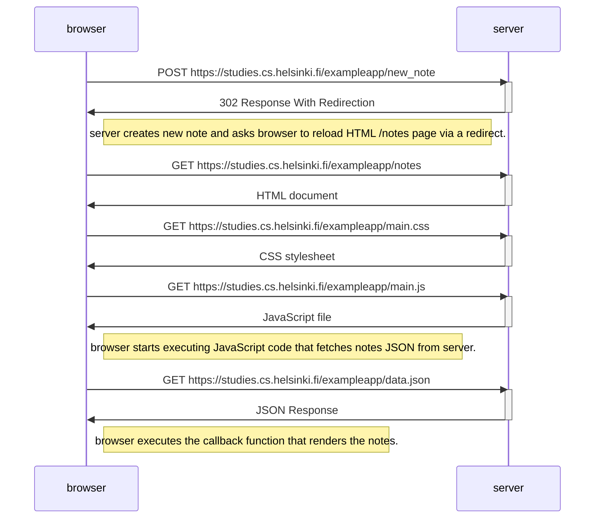

# New note diagram

Diagram reflecting the interaction between the browser client and the server when making an HTTP Post
request creating a new note.

```mermaid
    sequenceDiagram
    participant browser
    participant server

    browser->>server: POST https://studies.cs.helsinki.fi/exampleapp/new_note
    activate server
    server->>browser: 302 Response With Redirection
    deactivate server

    Note left of server: server creates new note and asks browser to reload HTML /notes page via a redirect.

    browser->>server: GET https://studies.cs.helsinki.fi/exampleapp/notes
    activate server
    server->>browser: HTML document
    deactivate server

    browser->>server: GET https://studies.cs.helsinki.fi/exampleapp/main.css
    activate server
    server->>browser: CSS stylesheet
    deactivate server

    browser->>server: GET https://studies.cs.helsinki.fi/exampleapp/main.js
    activate server
    server->>browser: JavaScript file
    deactivate server

    Note right of browser: browser starts executing JavaScript code that fetches notes JSON from server.

    browser->>server: GET https://studies.cs.helsinki.fi/exampleapp/data.json
    activate server
    server->>browser: JSON Response
    deactivate server

    Note right of browser: browser executes the callback function that renders the notes.
```