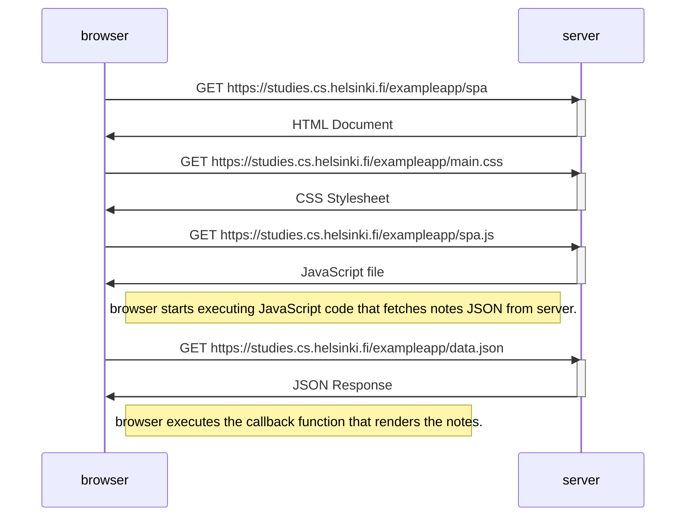

# Single page application diagram

Diagram reflecting the operations that occur between the client and the server when a connection is
established to the notes SPA application.

```mermaid
    sequenceDiagram
    participant browser
    participant server

    browser->>server: GET https://studies.cs.helsinki.fi/exampleapp/spa
    activate server
    server->>browser: HTML Document
    deactivate server

    browser->>server: GET https://studies.cs.helsinki.fi/exampleapp/main.css
    activate server
    server->>browser: CSS Stylesheet
    deactivate server

    browser->>server: GET https://studies.cs.helsinki.fi/exampleapp/spa.js
    activate server
    server->>browser: JavaScript file
    deactivate server

    Note right of browser: browser starts executing JavaScript code that fetches notes JSON from server.

    browser->>server: GET https://studies.cs.helsinki.fi/exampleapp/data.json
    activate server
    server->>browser: JSON Response
    deactivate server

    Note right of browser: browser executes the callback function that renders the notes.
```