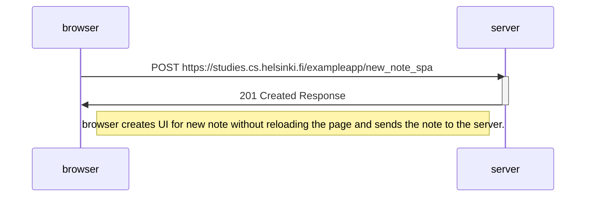

# Simple page application with new note diagram

Diagram reflecting the operations performed between the client and the server when adding
a new note in the SPA application.

```mermaid
    sequenceDiagram
    participant browser
    participant server

    browser->>server: POST https://studies.cs.helsinki.fi/exampleapp/new_note_spa
    activate server
    server->>browser: 201 Created Response
    deactivate server

    Note right of browser: browser creates UI for new note without reloading the page and sends the note to the server.
```